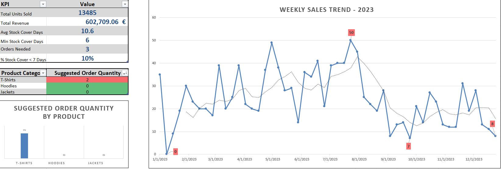

# 🧾 Retail Sales & Inventory Dashboard (Excel Project)

This Excel dashboard simulates a retail environment by combining weekly sales trends, inventory metrics, and automatic ordering logic.

It is designed to support roles like **Merchandiser, Allocator, Buyer**, and **Retail Analyst** by offering a clear and functional overview of product performance and stock availability.

---

## 📸 Dashboard Preview



---

## 📊 Key Features

✅ KPI Cards:
- Total Units Sold  
- Total Revenue  
- Avg & Min Stock Cover Days  
- % of Products Below Stock Threshold  
- Suggested Orders Trigger

✅ Charts:
- **Sales Trend Line Chart** with Moving Average  
- **Suggested Order Quantity per Product** (Bar Chart)

✅ Inventory Metrics:
- Reorder Point (ROP), Safety Stock  
- Stock Cover Days & Suggested Order Quantity  
- Lead Time logic and risk alerts

---

## 💡 What This Project Demonstrates

- ✅ Advanced Excel Formulas (IF, SUMIFS, ROUNDUP, VLOOKUP)  
- ✅ Forecasting logic based on lead time and average daily sales  
- ✅ Clean dashboard layout & visual storytelling  
- ✅ Realistic use case for merchandising/supply chain

---

## 🛠 Tools Used

- Microsoft Excel  
- Excel Charts (Line, Column)  
- Conditional Formatting  
- Forecast & Inventory Planning Logic

---

## 📁 Folder Structure

```
📦 retail-sales-inventory-dashboard/
├── sales_stock_forecast_data.xlsx
├── images/
│   ├── dashboard_overview.png
│   ├── (optional) kpi_cards.png
│   └── (optional) sales_trend_chart.png
└── README.md
```

---

## 🚀 How to Use

1. Open `sales_stock_forecast_data.xlsx`
2. Navigate to the `Dashboard` sheet
3. Explore KPIs, charts, and suggested order logic
4. Try adjusting weekly sales in `Forecast` to simulate different demand patterns

---

## 🔜 Future Enhancements (Optional)

- Add dynamic slicers or dropdown filters  
- Expand to multi-store logic  
- Include seasonal indexes for forecast tuning
